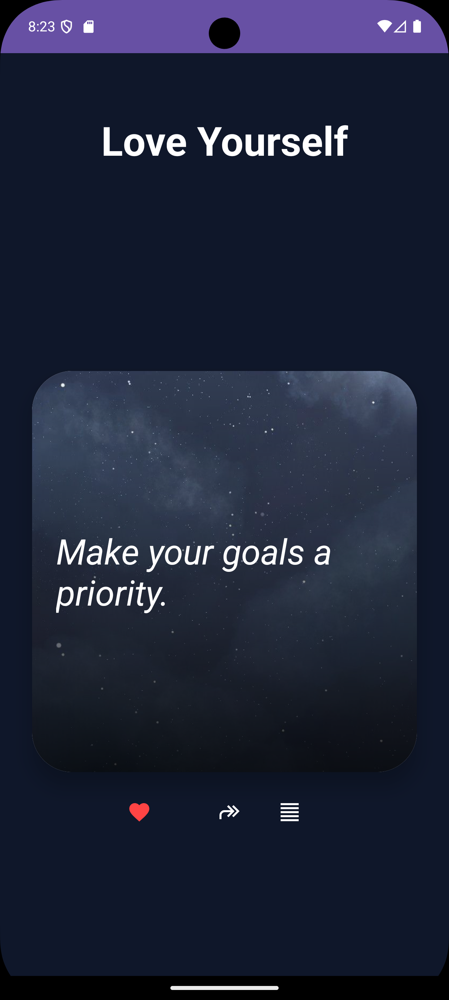

# Quote of the Day App

An Android application that displays motivational and inspirational quotes.  
The app fetches quotes from an online API and also supports offline mode using a local database.

---

##  Features

-  Fetch random quotes from API
-  Offline quote support
-  Add quotes to Favorites
-  Delete from Favorites
-  Share quotes via social media
-  Local database storage (SQLite)
-  Clean and simple UI

---

##  Tech Stack

- Java
- Android Studio
- SQLite Database
- RecyclerView
- Volley API
- Git & GitHub

---

##  Project Structure

- MainActivity → Displays quotes
- FavoritesActivity → Shows saved quotes
- QuoteDatabase → Handles local storage
- FavoritesAdapter → RecyclerView adapter

---

##  Focus Areas Covered

✔ API Usage  
✔ Local Data Handling  
✔ UI Design  
✔ User Interaction  

---
##  Screenshots

###  Main Screen
<p align="center"
  
---

###  Favorites Screen
<p align="center"
  
---

##  Developed By

Lovely Chourasia
